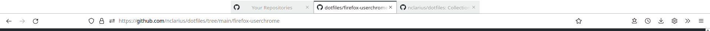

# Firefox Userchrome

Custom Firefox style file with the following changes:

- make tabs look like actual tabs, and have the active tab better visually distinguished by means of an indicator line,
- center-align the tabs in the tab bar and the tab labels in the tab.

## Installation

1. Download: GitHub repo > green top right button *Code* > *Download ZIP* > unpack and extract `userchrome.css` .

2. For how to install a userchrome file, see e.g. [here](https://www.howtogeek.com/334716/how-to-customize-firefoxs-user-interface-with-userchrome.css/).

